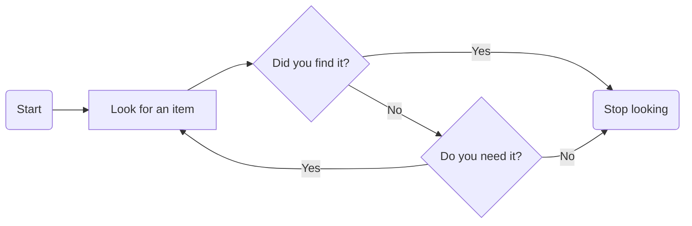
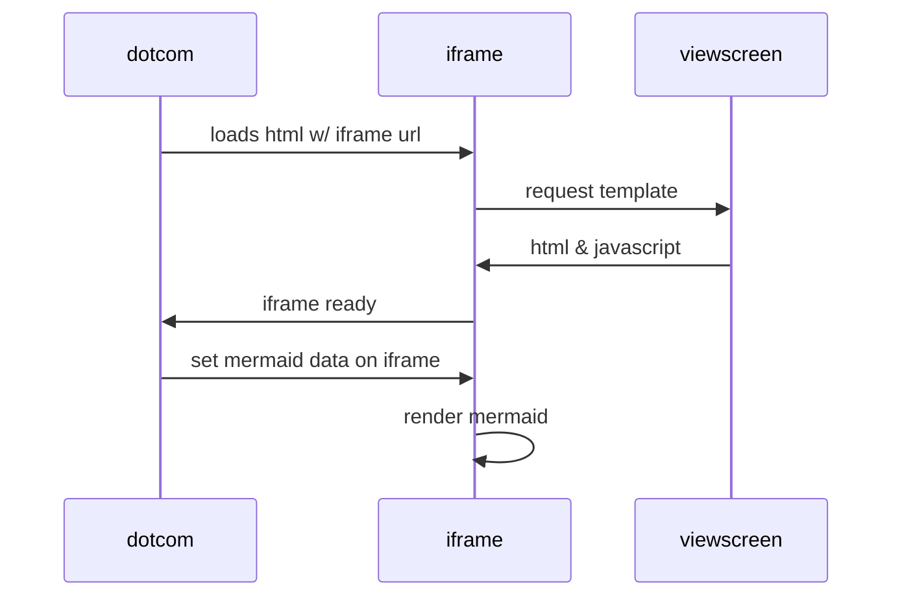

```mermaid
graph LR

A(Start)

A --> B[Look for an item]

B --> C{Did you find it?}
C -->|Yes| D(Stop looking)
C -->|No| E{Do you need it?}
E -->|Yes| B
E -->|No| D
```

```mermaid
sequenceDiagram
    participant dotcom
    participant iframe
    participant viewscreen
    dotcom->>iframe: loads html w/ iframe url
    iframe->>viewscreen: request template
    viewscreen->>iframe: html & javascript
    iframe->>dotcom: iframe ready
    dotcom->>iframe: set mermaid data on iframe
    iframe->>iframe: render mermaid
```
