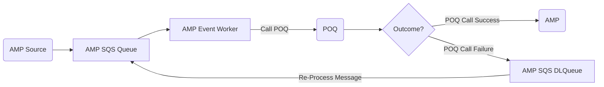
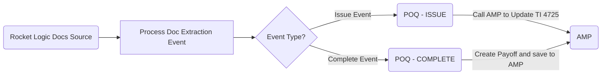

```mermaid
graph LR

A(AMP Source)
A --> B[AMP SQS Queue]
B --> C[AMP Event Worker]
C -->|Call POQ| D(POQ)
D -->E{Outcome?}
E -->|POQ Call Success| F(AMP)
E -->|POQ Call Failure| G[AMP SQS DLQueue]
G -->|Re-Process Message| B[AMP SQS Queue]
```

```mermaid
graph LR

A(Rocket Logic Docs Source)

A --> B[Process Doc Extraction Event]

B --> C{Event Type?}
C -->|Issue Event| D(POQ - ISSUE)
C -->|Complete Event| E(POQ - COMPLETE)
D -->|Call AMP to Update TI 4725| F(AMP)
E -->|Create Payoff and save to AMP| F(AMP)
```
